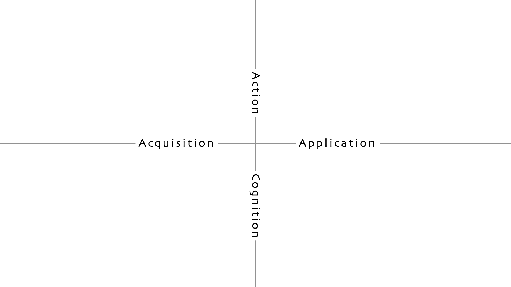

# TLDR-diataxis
## Goal
This project aims to be a short and accessible guide for the [The Diátaxis documentation framework](https://diataxis.fr/).
It includes:
- A reduced but broad explanation of the framework -  for general undersanding. 
- Pairs of "template & golden rules" for each of the documentation types are defined by Diátaxis - for for those in a hurry :D 
## Motivation
Offer a faster way to employ it so both maintainers and occasional contributes can agree on documentation standarts. 
Hopefully making [The Diátaxis framework](https://diataxis.fr/) more wide spread and known on the way.

## What is Diátaxis?
[The Diátaxis framework](https://diataxis.fr/) is a comprehensive guide for maintainers to build great docs.
### Diátaxis Pilars - the map
#### Why understand the map?
The map will help us understand each type of documentation, but even more importantly, it will help us understand __which type of documentation we are trying to create__ - and once we know that - we are beyond the hard part of achiving excellenct documentation. Yeah, this is most of the struggle. 

Take another look at the map (or graph, however you wish to think about it)
we'll see it multiple times.
Diátaxis defines 4 types of documentations:
1. __Tutorials__ - action-oriented activity, learning via doing
2. __How-to Guides__ - action-oriented activity, applying a skill, working toward a goal
3. __Reference__ - cognition-oriented activity, quick-information-lookup while applying a skill
4. __Explanations__ - cognition-oriented activity, learning something more deeply

the list above might be overwhelming for some; its more for setting the stage a being used as a reference we can lookup for the rest of this document. Let's look at the map and things will get clearer as we progress 🧑‍💻​

#### This map is of a *skill* or a *craft* :

Let's contemplate about this map for a few minutes. 

As you probably noticed, the axises are labeled with 4 types of *states* of the user that reads your docs:
1. Action
2. Acquisition 
3. Application
4. Cognition

##### 

Each type of documentation falls within a different quad of the map that represents the intersection of one of the four *states*! 

##### It's not clear! I agree! Let's simpify :) 

### Learn vs Work lens
Let's take those user *states* mentioned earlier and roughly divide them into two categories:
1. Work (*Application*)
2. Learn (*Acquisition*)
(In other words: The X-axis!)

and from now on, we keep those division lens and look at everything via them. 
Let me explain breifly: 
#### When we learn something:
We are not working. Or not producing anytihng of value except our own ***acquision*** of some knoweldge or skill.
We are looking for a resource that will teach us some *tool* or *concept* or basic *knowledge* that we know we currently lack.
In other words, we are not creating anything valueable that someone else can use (code, article, tools, etc.).
**We are focused on learning a concept - the concept we look to _acquire_ and be comfortable with.**
**We are asking ourselves:**
> Can you teach me *X* ?

for Ex: 
You are a python developer and you arrive at a new company. You clone the repo and you see that all of the tests are written in the pytest framework. Supposed you used other testing frameworks so far and the pytest form is unreadable for you at the moment. You must learn the framework basics in order to start contributing to the project (assume this is project that enforces tests coverage). 
You are looking for someone to take you by the hand and teach you the framework's basics - __that's a Tutorial.__
| Such a Tutorial **cannot** and **should not** teach | where it belongs | category |
|-------------------------------------------------------|------------------|----------|
| how to implement a pytest plugin                      | How-to           | working |
| hot to parametrize fixtures                           | How-to           | working |
| pytest's internal mechanisms                          | Explanation      | Learning |
| Its internal APIs                                     | Reference        | Working  |

__Why?__
A tutorial is aiming at teaching a concept that the pupil can generalize build a skill upon, and it is hyper focused on action-learning. __Almost any__ explanation is unnecessary here and distructs the pupil. Resis the temptation to explain in a tutorial. It's like a cooking book that teaches you basic cooking concepts, but not complete recipes - it walks you throu frying, baking and slicing - pointing our attention at things that will help you aquire the general skills so you can capatelize on them when you need to! 

*However...*
#### ...When we work on somehting 
We already have *sifficient working knowledge/skill* in the field or craft. 
We already *Acquired* the basics and the conceptual knowledge and now we are looking to *apply* it into something meaningful and productive.
We know roughly what we are doing, what we should do, and we have some idea of ways to achieve our goal, but it's vaug, at best. We know there's a way - we just need someone that will show it to us. 
**We are focused on the goal - the thing we want to get *done*. Our desitinaiton. 
We are asking ourselves:**
> How-to do *X*?

For Ex:
supposed you are a Python developer looking for a way to make your test suite more compact and easy to maintain while not compromising on the coverage of your tests (in fact, your'e looking for a way to get more coverage with less hussle). Your'e working with pytest for a while and you comfotably write tests and fixtures that sutisfied you up until now (you alreday *aquired* the skill of working with pytest and its basic concepts). 
You notice the boliraplate patterns in your suite and you know that some parametrizatoin solutions are out there, and you step on a pytest How-to guide: ***"How to parametrize your tests"***. Great. 
| Such a How-to guide **cannot** and **should not** explain | where it belongs | category |
|-----------------------------------------------------------|------------------|----------|
| the basics of pytest                                      | Tutorial         | Learning |
| pytest's core featuers                                    | Tutorial         | Learning |
| its internal mechanisms                                  | Explanation      | Learning |
| Its internal APIs                                         | Reference        | Working  |

##### why?
__Answer:__ It must stay hyper focused on the goal - show you how to parametrize your tests; **get that work *done*.**
Remeber: How-to guide is *work-oriented* document, hyper focused on the goal. It's like a recipe - you use it to follow instruction towards a specific dish - not to learn cooking's basics (that's tutorial), or contemplate on cooking chimestry and why oil makes everything taste better (explanation) or what are the nutritions facts of our favorate ingridient (reference). 
*More on __Referecne__ and __Explanation__ right away*

## Ok. We understand Tutorials and How-to guides, but what about Reference and Explanation?
---

## Do vs Think lens
Let's create a nother way of devision of our user states described by the axises:

1. Do (*Action*)
2. Think (*Cognition*)

In other words: the Y-axis! 
From now on, we put those "Do vs Think" lens *on top* of our previuos "Learn vs Work" lens, so we see everything via both of them!

### When we are in "Doing" mode
We do not contemplate about things, maybe just a little, but most of the time it's our favorite keyboard caps clickin' :D .
"Doing" (*action*) isn't exclusively bound to either Learning or Working. It exists in both of them (tho I agree it is more clearly linked to Working), however, a good tutorial is one that pushes the pupil to do stuff and learn via action. 
Recall the map again, notice action(doing) exists for both Aquisition(learning) and Application(action):

Tutorials and How-to Guides, despite belonging to the different categories of Learning and Doing correspondingly, share in common the fact that their are action-oriented towards the reader. In Tutorials the users is looking to learn a concept and we guide them via action-orinted lesson, while in the How-to Guide the user looks to accomplish a specific goal.

### When we are in "Thinking" mode
There's less clicking noise from our keyboard. We turn on noise cancellation. We contemplate about the concept, either breifly when we need a quick lookup to something (Reference) or deeply for longer period of time when we are curiuos and wish to gain deep understanding and learn the inner workings of our tools (Explanation). 

#### What's a Reference? 
A dry collection of small and densely compact pieces of information. And by information we mean __nothing but information__. There're no opinions or explanations in the reference (tho some examples for context are OK when necessary) and there's no teaching!
 
Examples:
| context | example of reference |
|-----------------------------|-|
| cooking | the nutritions facts on the back of a product|
| Technical textbook | glossary or explanations at the end of the book | 
| __software documentation__ | __API reference__ - a dry list of the methods / __Architecture diagram__ - lines connecting rectengles representing different software components|

We're focused here on the software angle of things. 
API reference in software documentation is (usually auto generated) list of the class and methods, with little and short explanation of each in case the name isn't clear. 

##### If reference is *thinking* (Cognition) and *working* (Application) related, when the user approaches it in the real world? 
When they need a quick lookup for something. 
For Ex:
- A user is looking for a specific endpoint of your API. 
- A user is trying to build a plugin that expands your tool's ecosystem. they'll look and consider possible entry points more than once. Each time they'll go back to your reference and lookup viable options. 

#### What's an Explanation? 

